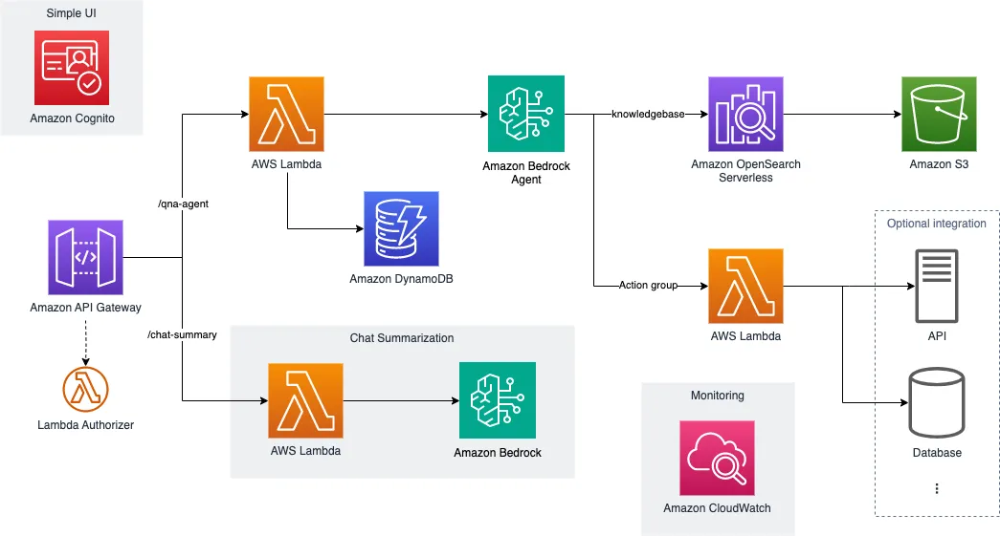
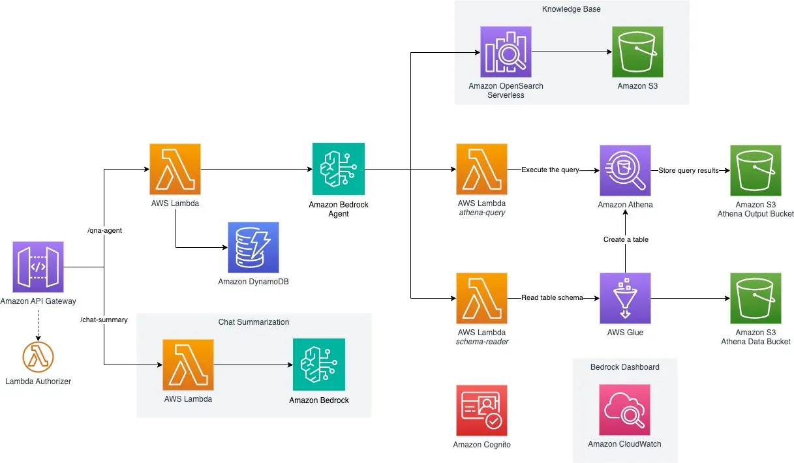

# AWS GenAI Lab - 워크숍 안내

<aside>
💡 **AWS GenAI Lab** 은 검증된 아키텍처와 배포 패턴을 활용하여 고객 환경에 빠르게 생성형 AI 환경을 구축할 수 있도록 도와드립니다.  
2주간 배포 Workshop 및 SA Office Hour를 통한 맞춤형 기술 지원으로 실질적인 비즈니스 성과를 창출하는 것을 목표로 합니다.
</aside>

---

## 🧑‍🎓 목표 아키텍처

### Option 1 👉 지식기반 챗봇

### Option 2 👉 Text2SQL : 자연어 쿼리 서비스

---

## 🛠️ 워크숍 개요

- 워크숍을 통해 위 아키텍처 중 하나를 고객 환경에 직접 구성합니다.
- 고객의 데이터 및 요구사항에 맞춰 아키텍처를 커스터마이징하여 최적화된 워크로드를 제공합니다.
- 완성된 워크로드가 실제 서비스 요구사항을 충족하는지 기술적으로 검증합니다.
- SA Office Hour를 통해 구축 이후의 운영 및 고도화까지 함께 논의합니다.

---

## 📅 기간

- 총 2주간 진행  
  (1주차: 아키텍처 설계 및 데이터 연동, 2주차: 테스트 및 검증)

---

