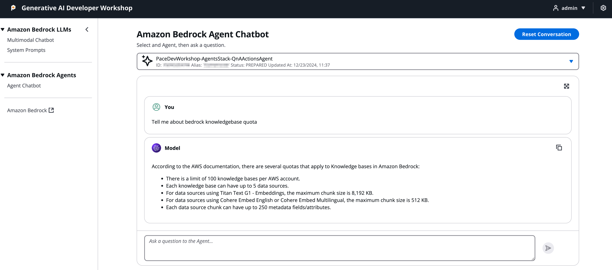

import { Steps } from '@astrojs/starlight/components';
import { Tabs, TabItem } from '@astrojs/starlight/components';
import { Card, CardGrid } from '@astrojs/starlight/components';
import { FileTree } from '@astrojs/starlight/components';

This ReactJS UI application provides a frontend interface for the `packages/cdk_infra` backend, enabling interaction with:
- Amazon Bedrock Agents
- Knowledge Bases
- Large Language Models

## Key Features

<CardGrid>
  <Card title="Authentication" icon="approve-check">
    Secure user authentication using Amazon Cognito
  </Card>

  <Card title="Multimodal Chatbot" icon="comment-alt">
    Bedrock chatbot interface with system prompt support
  </Card>

  <Card title="Prompt Management" icon="setting">
    System prompts management using browser's [local storage](https://developer.mozilla.org/en-US/docs/Web/API/Window/localStorage)
  </Card>

  <Card title="Agent Integration" icon="rocket">
    Direct integration with Amazon Bedrock Agents
  </Card>
</CardGrid>

## Project Structure

:::tip[Project Organization]
The project follows a standard React application structure with clear separation of concerns.
:::

<FileTree>
- packages/
  - reactjs_ui/                                # Frontend application
    - public/                                  # Static assets
    - src/                                     # Source code directory
      - assets/                                # Reusable static assets
      - components/                            # Shared React components
      - localData/                             # Local storage state management
      - styles/                                # CSS and styling files
      - utils/                                 # Utility functions
      - views/                                 # Page components
      - aws-exports.js                         # AWS configuration
    - package.json                             # Project dependencies
</FileTree>

## Application Components

### Bedrock LLM Integration

<Tabs>
  <TabItem label="Multimodal Chatbot">
    <Steps>
    1. **Model Selection**
       - Choose from available Bedrock models
       - Configure model parameters
    
    2. **Prompt Management**
       - Create and save custom prompts
       - Use stored prompts in conversations
    
    3. **Interaction**
       - Real-time chat interface
       - Support for various input types
    </Steps>
  </TabItem>
  
  <TabItem label="System Prompts">
    <Steps>
    1. **Local Storage**
       - Persistent prompt storage
       - Browser-based state management
    
    2. **Prompt Features**
       - Create custom prompts
       - Edit existing prompts
       - Delete unused prompts
    </Steps>
  </TabItem>
</Tabs>

### Bedrock Agent Integration

<Steps>
1. **Agent Selection**
   - Choose agent ID or alias
   - View agent capabilities

2. **Conversation Interface**
   - Start new conversations
   - Continue existing sessions
   - View conversation history

3. **Response Handling**
   - Display agent responses
   - Handle various response types
   - Show action results
</Steps>

## Important Considerations

:::caution[Production Usage]
This is a reference implementation demonstrating backend service integration. While functional, it should not be considered for production use. 

Consider the following practices for a more robust implementation of a UI:
- Keep sensitive configuration in environment variables
- Implement proper error handling
- Add loading states for async operations
- Consider implementing proper state management for larger applications
:::

:::tip[Need Help?]
Check our [FAQ](/faq/faq) or open an issue in the repository
:::