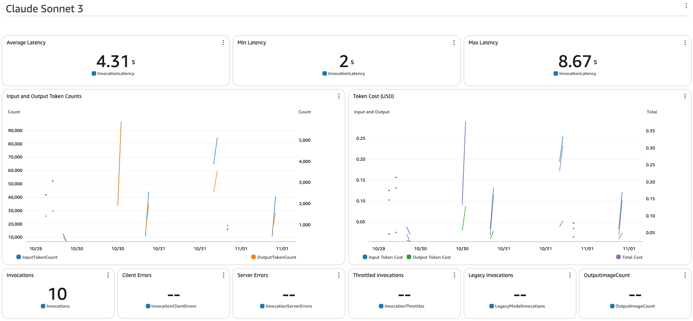

import { Steps } from '@astrojs/starlight/components';
import { Tabs, TabItem } from '@astrojs/starlight/components';
import { Card, CardGrid } from '@astrojs/starlight/components';

<CardGrid>
  <Card title="Chatbot Customization" icon="message">
    Customize prompts, knowledge base, and actions for the Chatbot implementation
  </Card>

  <Card title="Text2SQL Customization" icon="database">
    Configure your own database schema and customize Text2SQL capabilities
  </Card>

  <Card title="CloudWatch Dashboard Customization" icon="chart">
    Set up and customize CloudWatch dashboards for performance tracking
  </Card>
</CardGrid>

## Chatbot Customization

:::caution[Prerequisites]
This section is **only applicable** if you set `"deploy:case": "chatbot"` in your configuration.
For Text2SQL customization, skip to the [Text2SQL section](#text2sql-customization).
:::

### Customize Prompts

<Steps>
1. **Locate Prompt Files**
   - Navigate to `packages/cdk_infra/src/prompt/instruction`
   - Select your use case folder: `chatbot` or `text2sql`

2. **Modify Instructions**
   - Open the prompt text file
   - Edit instructions as needed
   - Save your changes

3. **Deploy Changes**
   ```bash
   pnpm cdk_infra:deploy
   ```
</Steps>

#### Update Agent Alias (Optional)

:::tip
When you modify your agent's configuration, a new version is created. Use aliases to manage different versions without changing your code.
:::

For alias updates, see the [API Testing Guide](/guides/api-testing-guide#update-agent-alias).

### Configure Knowledge Base

:::note[Availability]
This section applies only if `"deploy:knowledgebase": true` is set in your configuration.
:::

<Steps>
1. **Access Knowledge Base**
   - Open [Amazon Bedrock Console](https://console.aws.amazon.com/bedrock)
   - Navigate to **Knowledge bases**
   - Select `KBBedrockAgenowledgeBase`

2. **Add Custom Data**
   - Click **Data Source** to access S3 bucket
   - Upload your documents
   - Return to Knowledge Base
   - Select **Amazon S3 Data source**
   - Click **Sync** for vector embedding generation

3. **Additional Options**
   - Configure alternative data sources (Web crawler, SharePoint)
   - Customize embedding settings
</Steps>

### Create Custom Actions

<Tabs>
  <TabItem label="Sample Actions">
    Two demonstration actions are provided:
    - `escalate`: Live agent escalation
    - `password_change`: Account password changes

    :::note
    These are demonstration actions without actual system changes.
    :::
  </TabItem>

  <TabItem label="Testing">
    <Steps>
    1. Open [Bedrock console](https://console.aws.amazon.com/bedrock)
    2. Navigate to **Agents**
    3. Select your agent
    4. Type: "I'd like to escalate"
    5. Test with email:
       - "test@thebigtest.com" for success
       - Any other email for failure
    </Steps>
  </TabItem>

  <TabItem label="Customization">
    <Steps>
    1. **Modify Actions**
       - Navigate to `cdk_infra/src/backend/agents/lambda/account_actions`
       - Update existing or add new actions
       - Ensure detailed descriptions for LLM understanding

    2. **Generate Schema**
       ```bash
       pnpm python:init-python-venv
       source ./.venv/bin/activate
       pnpm cdk_infra:generate-openapi-schemas
       ```

    3. **Deploy Changes**
       ```bash
       pnpm cdk_infra:deploy
       ```
    </Steps>
  </TabItem>
</Tabs>

## Text2SQL Customization

:::note[Getting Started]
Before customizing, familiarize yourself with the sample implementation using the provided ecommerce database, and its sample data.
:::

### Sample Database

#### Database Schema

<Tabs>
  <TabItem label="Products Table">
    | Column Name  | Data Type | Constraints |
    |--------------|-----------|-------------|
    | product_id   | int       | Primary Key |
    | product_name | string    |             |
    | category     | string    |             |
    | price        | decimal   |             |
    | description  | string    |             |
    | created_at   | timestamp |             |
    | updated_at   | timestamp |             |
  </TabItem>

  <TabItem label="Reviews Table">
    | Column Name   | Data Type | Constraints |
    |---------------|-----------|-------------|
    | review_id     | int       | Primary Key |
    | product_id    | int       | Foreign Key |
    | customer_name | string    |             |
    | rating        | int       |             |
    | comment       | string    |             |
    | review_date   | timestamp |             |
  </TabItem>
</Tabs>

:::tip[Relationships]
- One-to-Many relationship between Products and Reviews
- `product_id` in Reviews references Products table
:::

#### Sample Queries

Try these questions with your AthenaAgent:
- "What are the items between USD 100 and USD 200?"
- "What are the items with the lowest reviews?"
- "What is the best rated product per category?"

#### Key Features

<CardGrid>
  <Card title="SQL Generation" icon="pencil">
    Converts natural language to SQL queries with visible trace logging
  </Card>

  <Card title="Query Execution" icon="rocket">
    Uses athena-query tool to execute generated queries
  </Card>

  <Card title="Error Handling" icon="error">
    Analyzes errors and modifies queries automatically
  </Card>

  <Card title="Schema Discovery" icon="document">
    Dynamically checks available tables and columns
  </Card>
</CardGrid>

#### Code Interpreter
:::caution
Code interpreter feature is currently not supported in Seoul region (ap-northeast-2).
:::
:::tip[What is it?]
Code Interpreter enhances TEXT2SQL capabilities with advanced code generation and execution.
:::

Try these prompts:
- "Calculate average rating per product category with a bar chart"
- "Analyze price and rating correlation"

Find more in [Generate, run, and test code for your application by enabling code interpretation](https://docs.aws.amazon.com/bedrock/latest/userguide/agents-code-interpretation.html)

### Customize Your Implementation

:::caution[Prerequisites]
This section is **only applicable** if you set `"deploy:case": "text2sql"` in your configuration.
:::

<Steps>
1. **Prepare Your Data**
   - Document table schemas
   - Prepare CSV/Parquet data files
   - Create sample queries

2. **Update Glue Table**
   :::caution
   The `athena-stack.ts` file contains a sample **products** table. Modify carefully to avoid conflicts.
   :::
   - Navigate to `cdk_infra/src/stacks/athena-stack.ts`
   - Update column definitions
   - Modify table names if needed

3. **Update Templates**
   Navigate to `/packages/cdk_infra/src/prompt/orchestration/text2sql/claude/sonnet3.5/templates/` and modify:
   - `tables.txt`: Table listings and comments
   - `schema.txt`: Column details
   - `query_example.txt`: Sample queries

4. **Generate New Prompt**
   ```bash
   pnpm cdk_infra:generate-prompt
   ```
5. **Deploy changes**
     ```bash
     pnpm cdk_infra:deploy
     ```
</Steps>

## CloudWatch Dashboard Customization

Monitor your agent's performance and costs using the provided CloudWatch Dashboard.

<Steps>
1. **Access Dashboard**
   - Open CloudWatch Console
   - Navigate to Dashboards
   - Select your project dashboard

2. **View Metrics**
   

3. **Customize Configuration**
   - Navigate to relevant stack file:
     ```bash
     # For Chatbot
     packages/cdk/infra/src/stacks/bedrock-agent-stack.ts
     # For Text2SQL
     packages/cdk/infra/src/stacks/bedrock-text2sql-agent-stack.ts
     ```
   - Update model ID and pricing
   - Deploy changes:
     ```bash
     pnpm cdk_infra:deploy
     ```
</Steps>

:::note[Cost Estimation]
Default dashboard shows Anthropic Sonnet model metrics. Estimates exclude costs for services like OpenSearch Serverless.
:::