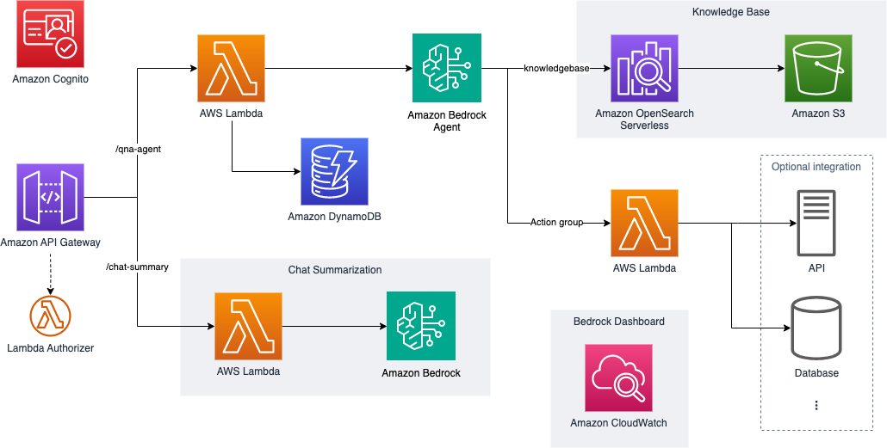
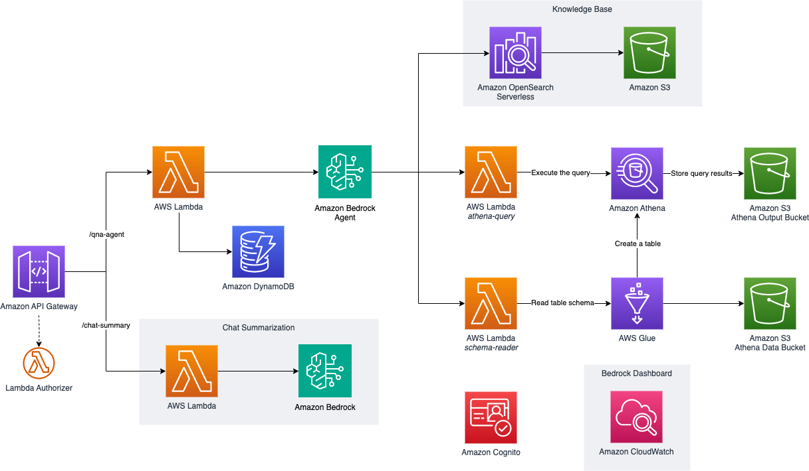

import { Card, CardGrid } from '@astrojs/starlight/components';
import { Tabs, TabItem } from '@astrojs/starlight/components';
import { Steps } from '@astrojs/starlight/components';

## Available Deployment Options

Choose the deployment scenario that best matches your requirements. Each option comes with its own set of features and AWS service integrations.

<CardGrid stagger>
  <Card title="Chatbot" icon="seti:default">
    AI-powered chatbot with an Amazon Bedrock Agent with knowledge base and action group integration
    
    **Key Features**
    - Standard chatbot with an Amazon Bedrock Agent
    - Sample action groups powered by AWS Lambda (password change, escalation)
    - A Knowledge base backed by Amazon OpenSearch Serverless with metadata filtering
    - Amazon Cognito-authenticated UI
    - Chat summary capability
    
    [Learn more about the Chatbot](/intro/use-case-selection#chatbot)
  </Card>

  <Card title="Text2SQL" icon="seti:odata">
    Natural language to SQL conversion using an Amazon Bedrock Agent
    
    **Key Features**
    - Text-to-SQL conversion with default prompts
    - Sample Amazon Athena tables with demo data
    - SQL query execution through an action group powered by AWS Lambda
    - Dynamic schema extraction
    - Knowledge base integration (optional)
    
    [Learn more about Text2SQL](/intro/use-case-selection#text2sql)
  </Card>

  <Card title="Complete Solution" icon="rocket">
    Deploy both Chatbot and Text2SQL capabilities
    
    **Key Features**
    - All features from both use cases
    - Comprehensive demonstration environment
    - Full stack deployment
    - Complete monitoring setup
    
    [Learn more about Complete Solution](/intro/use-case-selection#complete-solution)
  </Card>
</CardGrid>

## Service Integration Overview

<Tabs>
  <TabItem label="Chatbot Services">
    - [Amazon Bedrock](https://aws.amazon.com/bedrock/)
    - [Amazon OpenSearch Serverless](https://aws.amazon.com/opensearch-service/)
    - [Amazon S3](https://aws.amazon.com/s3/)
    - [Amazon API Gateway](https://aws.amazon.com/api-gateway/)
    - [AWS Lambda](https://aws.amazon.com/lambda/)
    - [Amazon DynamoDB](https://aws.amazon.com/dynamodb/)
    - [Amazon CloudWatch](https://aws.amazon.com/cloudwatch/)
    - [Amazon IAM](https://aws.amazon.com/iam/)
    - [Amazon Cognito](https://aws.amazon.com/cognito/)
  </TabItem>
  
  <TabItem label="Text2SQL Services">
    - [Amazon Bedrock](https://aws.amazon.com/bedrock/)
    - [Amazon S3](https://aws.amazon.com/s3/)
    - [AWS Glue](https://aws.amazon.com/glue/)
    - [Amazon Athena](https://aws.amazon.com/athena/)
    - [Amazon API Gateway](https://aws.amazon.com/api-gateway/)
    - [AWS Lambda](https://aws.amazon.com/lambda/)
    - [Amazon DynamoDB](https://aws.amazon.com/dynamodb/)
    - [Amazon CloudWatch](https://aws.amazon.com/cloudwatch/)
    - [Amazon IAM](https://aws.amazon.com/iam/)
    - [Amazon Cognito](https://aws.amazon.com/cognito/)
  </TabItem>
</Tabs>

:::tip[Recommendation]
If you're new to the project, we recommend starting with either the Chatbot or Text2SQL use case individually. This will help you understand the components better before deploying the complete solution.
:::

## Available Use Cases

### Chatbot
AI-powered chatbot with knowledge base and action group integration

#### Features
- Amazon Bedrock Agent with standard chatbot prompt
- Sample action group for the Agent: password change, escalation
- Knowledge base and metadata filtering with sample data
- Sample UI running on your local host with Cognito auth
- REST API to integrate with your own UI
   - QnA Agent API: Lambda backend to invoke Agent and store session information in DynamoDB table
   - Chat summary API (Optional): invoke Amazon Lite model to summarize the chat history for future use
   - Lambda custom authorizer as an example

### Text2SQL
Natural language to SQL conversion using Bedrock Agent

#### Features
- Amazon Bedrock Agent with default Text2SQL prompts
   - Agent Instruction
   - Orchestration template
- Sample Athena tables `products` and `reviews` with sample data
- Bedrock action group to execute SQL query against Athena (`athena-query`)
- Bedrock action group to dynamically extract schema information from Athena (`schema-reader`)
- (Optional) Knowledge base and metadata filtering with sample data
- Sample UI running on your local host with Cognito auth
- REST API integration capabilities

### Complete Solution
:::note
This option will deploy both the Chatbot and Text2SQL use cases, creating all resources mentioned above.
:::

## Next Steps

After choosing your use case:
<Steps>
1. Follow the [Deployment Guide](/intro/deployment) for step-by-step instructions.

2. Customize your solution using the [Customization Guide](/guides/customization-guide).

3. Test your deployment with the [Sample API Testing Guide](/guides/api-testing-guide).

4. When you're done, follow the [Cleanup Guide](/guides/cleanup-guide).
</Steps>

:::note
All deployments include basic infrastructure such as:
- Cognito authentication
- REST API endpoints
- DynamoDB session storage
- CloudWatch monitoring
:::