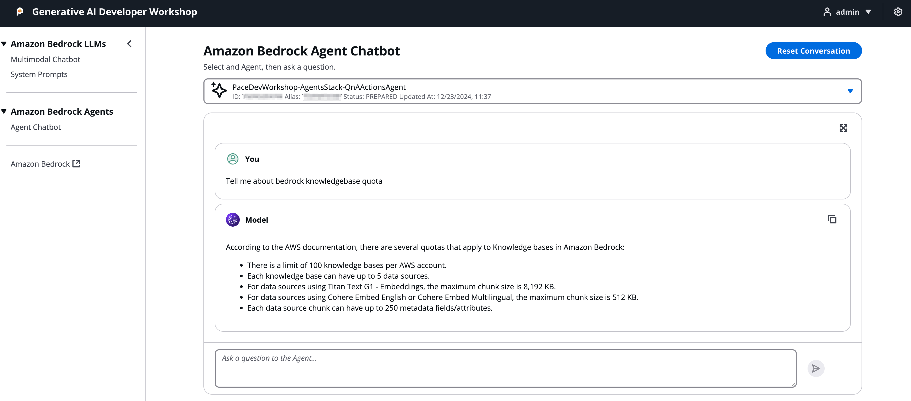

import { Steps } from '@astrojs/starlight/components';
import { Tabs, TabItem } from '@astrojs/starlight/components';
import { Card, CardGrid } from '@astrojs/starlight/components';
import { FileTree } from '@astrojs/starlight/components';

이 ReactJS UI 애플리케이션은 `packages/cdk_infra` 백엔드를 위한 프론트엔드 인터페이스를 제공하여 다음과의 상호작용을 가능하게 합니다:
- Amazon Bedrock Agents
- 지식 베이스
- 대규모 언어 모델

## 주요 기능

<CardGrid>
  <Card title="인증" icon="approve-check">
    Amazon Cognito를 사용한 안전한 사용자 인증
  </Card>

  <Card title="멀티모달 챗봇" icon="comment-alt">
    시스템 프롬프트 지원이 포함된 Bedrock 챗봇 인터페이스
  </Card>

  <Card title="프롬프트 관리" icon="setting">
    브라우저의 [로컬 스토리지](https://developer.mozilla.org/en-US/docs/Web/API/Window/localStorage)를 사용한 시스템 프롬프트 관리
  </Card>

  <Card title="Agent 통합" icon="rocket">
    Amazon Bedrock Agents와의 직접 통합
  </Card>
</CardGrid>

## 프로젝트 구조

:::tip[프로젝트 구성]
이 프로젝트는 명확한 관심사 분리가 있는 표준 React 애플리케이션 구조를 따릅니다.
:::

<FileTree>
- packages/
  - reactjs_ui/                                # 프론트엔드 애플리케이션
    - public/                                  # 정적 자산
    - src/                                     # 소스 코드 디렉토리
      - assets/                                # 재사용 가능한 정적 자산
      - components/                            # 공유 React 구성 요소
      - localData/                             # 로컬 스토리지 상태 관리
      - styles/                                # CSS 및 스타일링 파일
      - utils/                                 # 유틸리티 함수
      - views/                                 # 페이지 구성 요소
      - aws-exports.js                         # AWS 구성
    - package.json                             # 프로젝트 의존성
</FileTree>

## 애플리케이션 구성 요소

### Bedrock LLM 통합

<Tabs>
  <TabItem label="멀티모달 챗봇">
    <Steps>
    1. **모델 선택**
       - 사용 가능한 Bedrock 모델 중에서 선택
       - 모델 매개변수 구성
    
    2. **프롬프트 관리**
       - 사용자 정의 프롬프트 생성 및 저장
       - 대화에서 저장된 프롬프트 사용
    
    3. **상호작용**
       - 실시간 채팅 인터페이스
       - 다양한 입력 유형 지원
    </Steps>
  </TabItem>
  
  <TabItem label="시스템 프롬프트">
    <Steps>
    1. **로컬 스토리지**
       - 지속적인 프롬프트 저장
       - 브라우저 기반 상태 관리
    
    2. **프롬프트 기능**
       - 사용자 정의 프롬프트 생성
       - 기존 프롬프트 편집
       - 사용하지 않는 프롬프트 삭제
    </Steps>
  </TabItem>
</Tabs>

### Bedrock Agent 통합

<Steps>
1. **Agent 선택**
   - Agent ID 또는 별칭 선택
   - Agent 기능 보기

2. **대화 인터페이스**
   - 새 대화 시작
   - 기존 세션 계속하기
   - 대화 기록 보기

3. **응답 처리**
   - Agent 응답 표시
   - 다양한 응답 유형 처리
   - 액션 결과 표시
</Steps>

## 중요 고려 사항

:::caution[프로덕션 사용]
이것은 백엔드 서비스 통합을 보여주는 참조 구현입니다. 기능적이지만 프로덕션 사용을 위한 것으로 간주해서는 안 됩니다.

더 강력한 UI 구현을 위해 다음 사항을 고려하세요:
- 민감한 구성은 환경 변수에 보관
- 적절한 오류 처리 구현
- 비동기 작업을 위한 로딩 상태 추가
- 더 큰 애플리케이션을 위한 적절한 상태 관리 구현 고려
:::

:::tip[도움이 필요하신가요?]
[FAQ](/ko/faq/faq)를 확인하거나 저장소에 이슈를 개설하세요.
::: 