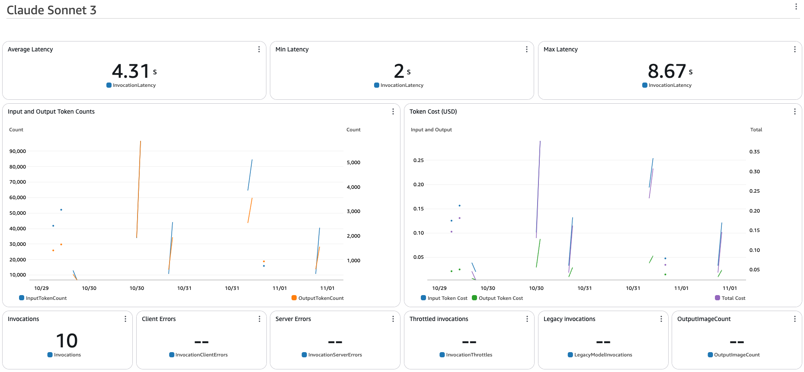

import { Steps } from '@astrojs/starlight/components';
import { Tabs, TabItem } from '@astrojs/starlight/components';
import { Card, CardGrid } from '@astrojs/starlight/components';

<CardGrid>
  <Card title="챗봇 커스터마이징" icon="message">
    챗봇 구현을 위한 프롬프트, 지식 베이스 및 액션 사용자 정의
  </Card>

  <Card title="Text2SQL 커스터마이징" icon="database">
    자체 데이터베이스 스키마 구성 및 Text2SQL 기능 사용자 정의
  </Card>

  <Card title="CloudWatch 대시보드 커스터마이징" icon="chart">
    성능 추적을 위한 CloudWatch 대시보드 설정 및 사용자 정의
  </Card>
</CardGrid>

## 챗봇 커스터마이징

:::caution[사전 요구사항]
이 섹션은 구성에서 `"deploy:case": "chatbot"`으로 설정한 경우에만 **적용 가능**합니다.
Text2SQL 커스터마이징은 [Text2SQL 섹션](#text2sql-커스터마이징)으로 건너뛰세요.
:::

### 프롬프트 사용자 정의

<Steps>
1. **프롬프트 파일 찾기**
   - `packages/cdk_infra/src/prompt/instruction`으로 이동
   - 사용 사례 폴더 선택: `chatbot` 또는 `text2sql`

2. **지침 수정**
   - 프롬프트 텍스트 파일 열기
   - 필요에 따라 지침 편집
   - 변경 사항 저장

3. **변경 사항 배포**
   ```bash
   pnpm cdk_infra:deploy
   ```
</Steps>

#### Agent 별칭 업데이트(선택 사항)

:::tip
Agent 구성을 수정하면 새 버전이 생성됩니다. 코드를 변경하지 않고 다른 버전을 관리하려면 별칭을 사용하세요.
:::

별칭 업데이트는 [API 테스팅 가이드](/ko/guides/api-testing-guide#agent-별칭-관리)를 참조하세요.

### 지식 베이스 구성

:::note[가용성]
이 섹션은 구성에서 `"deploy:knowledgebase": true`로 설정한 경우에만 적용됩니다.
:::

<Steps>
1. **지식 베이스 접근**
   - [Amazon Bedrock 콘솔](https://console.aws.amazon.com/bedrock) 열기
   - **지식 베이스**로 이동
   - `KBBedrockAgenowledgeBase` 선택

2. **사용자 정의 데이터 추가**
   - **데이터 소스**를 클릭하여 S3 버킷에 접근
   - 문서 업로드
   - 지식 베이스로 돌아가기
   - **Amazon S3 데이터 소스** 선택
   - 벡터 임베딩 생성을 위해 **동기화** 클릭

3. **추가 옵션**
   - 대체 데이터 소스 구성(웹 크롤러, SharePoint)
   - 임베딩 설정 사용자 정의
</Steps>

### 사용자 정의 액션 생성

<Tabs>
  <TabItem label="샘플 액션">
    두 가지 데모 액션이 제공됩니다:
    - `escalate`: 실제 상담원 에스컬레이션
    - `password_change`: 계정 비밀번호 변경

    :::note
    이는 실제 시스템 변경 없이 시연하는 액션입니다.
    :::
  </TabItem>

  <TabItem label="테스팅">
    <Steps>
    1. [Bedrock 콘솔](https://console.aws.amazon.com/bedrock) 열기
    2. **Agents**로 이동
    3. Agent 선택
    4. "I'd like to escalate" 입력
    5. 이메일로 테스트:
       - 성공을 위한 "test@thebigtest.com"
       - 실패를 위한 다른 이메일
    </Steps>
  </TabItem>

  <TabItem label="커스터마이징">
    <Steps>
    1. **액션 수정**
       - `cdk_infra/src/backend/agents/lambda/account_actions`로 이동
       - 기존 액션 업데이트 또는 새 액션 추가
       - LLM 이해를 위한 자세한 설명 제공

    2. **스키마 생성**
       ```bash
       pnpm python:init-python-venv
       source ./.venv/bin/activate
       pnpm cdk_infra:generate-openapi-schemas
       ```

    3. **변경 사항 배포**
       ```bash
       pnpm cdk_infra:deploy
       ```
    </Steps>
  </TabItem>
</Tabs>

## Text2SQL 커스터마이징

:::note[시작하기]
커스터마이징 전에 제공된 전자상거래 데이터베이스와 샘플 데이터를 사용하여 샘플 구현에 익숙해지세요.
:::

### 샘플 데이터베이스

#### 데이터베이스 스키마

<Tabs>
  <TabItem label="제품 테이블">
    | 열 이름      | 데이터 타입 | 제약 조건    |
    |--------------|-----------|-------------|
    | product_id   | int       | 기본 키     |
    | product_name | string    |             |
    | category     | string    |             |
    | price        | decimal   |             |
    | description  | string    |             |
    | created_at   | timestamp |             |
    | updated_at   | timestamp |             |
  </TabItem>

  <TabItem label="리뷰 테이블">
    | 열 이름        | 데이터 타입 | 제약 조건    |
    |---------------|-----------|-------------|
    | review_id     | int       | 기본 키     |
    | product_id    | int       | 외래 키     |
    | customer_name | string    |             |
    | rating        | int       |             |
    | comment       | string    |             |
    | review_date   | timestamp |             |
  </TabItem>
</Tabs>

:::tip[관계]
- 제품과 리뷰 간의 일대다 관계
- 리뷰의 `product_id`는 제품 테이블을 참조
:::

#### 샘플 쿼리

AthenaAgent에서 다음 질문을 시도해보세요:
- "USD 100에서 USD 200 사이의 상품은 무엇인가요?"
- "가장 낮은 리뷰를 받은, 상품은 무엇인가요?"
- "카테고리별 최고 평점 제품은 무엇인가요?"

#### 주요 기능

<CardGrid>
  <Card title="SQL 생성" icon="pencil">
    가시적인 추적 로깅과 함께 자연어를 SQL 쿼리로 변환
  </Card>

  <Card title="쿼리 실행" icon="rocket">
    athena-query 도구를 사용하여 생성된 쿼리 실행
  </Card>

  <Card title="오류 처리" icon="error">
    오류를 분석하고 쿼리를 자동으로 수정
  </Card>

  <Card title="스키마 검색" icon="document">
    사용 가능한 테이블과 열을 동적으로 확인
  </Card>
</CardGrid>

#### 코드 인터프리터
:::caution
현재 코드 인터프리터 기능은 서울 리전(ap-northeast-2)에서 지원되지 않습니다.
:::
:::tip[무엇인가요?]
코드 인터프리터는 고급 코드 생성 및 실행으로 TEXT2SQL 기능을 향상시킵니다.
:::

다음 프롬프트를 시도해보세요:
- "막대 차트를 사용하여 제품 카테고리별 평균 평점 계산"
- "가격과 평점 상관관계 분석"

자세한 내용은 [코드 해석을 활성화하여 애플리케이션용 코드 생성, 실행 및, 테스트](https://docs.aws.amazon.com/bedrock/latest/userguide/agents-code-interpretation.html)에서 확인하세요.

### 구현 사용자 정의

:::caution[사전 요구사항]
이 섹션은 구성에서 `"deploy:case": "text2sql"`로 설정한 경우에만 **적용 가능**합니다.
:::

<Steps>
1. **데이터 준비**
   - 테이블 스키마 문서화
   - CSV/Parquet 데이터 파일 준비
   - 샘플 쿼리 작성

2. **실제 테이블 데이터 파일**
   - `packages/cdk_infra/src/assets/데이터베이스명/테이블명/테이블명.csv` 형태로 넣기
     - ex) `packages/cdk_infra/src/assets/ecommerce_data/products/products.csv`
3. **Glue 테이블 업데이트**
   :::caution
   `athena-stack.ts` 파일에는 샘플 **products** 테이블이 포함되어 있습니다. 충돌을 방지하기 위해 신중하게 수정하세요.
   :::
   - 수동으로 수정하는 경우
     - `cdk_infra/src/stacks/athena-stack.ts`로 이동
     - 열 정의 업데이트
     - 필요한 경우 테이블 이름 수정
   - athena stack 자동 생성 script 사용하는 경우
     - `tools/athena-generator` 경로로 이동하세요
     - 사전에 작성해온 Athena Stack 생성용 파일(athena_template.csv)을 해당 경로에 넣으세요.
     - cdk 생성 스크립트 실행 `python generate_athena_stack.py`
     - 생성된 athena-stack.ts 파일을 `packages/cdk_infra/src/stacks/text2sql` 하위에 넣으세요.

4. **템플릿 업데이트**
   `/packages/cdk_infra/src/prompt/orchestration/text2sql/claude/sonnet3.5/templates/`로 이동하여 수정:
   - `tables.txt`: 테이블 목록 및 주석
   - `schema.txt`: 열 세부 정보
   - `query_example.txt`: 샘플 쿼리

5. **새 프롬프트 생성**
   ```bash
   pnpm cdk_infra:generate-prompt
   ```
6. **변경 사항 배포**
     ```bash
     pnpm cdk_infra:deploy
     ```
</Steps>

## CloudWatch 대시보드 커스터마이징

제공된 CloudWatch 대시보드를 사용하여 Agent의 성능과 비용을 모니터링하세요.

<Steps>
1. **대시보드 접근**
   - CloudWatch 콘솔 열기
   - 대시보드로 이동
   - 프로젝트 대시보드 선택

2. **지표 보기**
   

3. **구성 사용자 정의**
   - 관련 스택 파일로 이동:
     ```bash
     # 챗봇의 경우
     packages/cdk/infra/src/stacks/bedrock-agent-stack.ts
     # Text2SQL의 경우
     packages/cdk/infra/src/stacks/bedrock-text2sql-agent-stack.ts
     ```
   - 모델 ID 및 가격 업데이트
   - 변경 사항 배포:
     ```bash
     pnpm cdk_infra:deploy
     ```
</Steps>

:::note[비용 추정]
기본 대시보드는 Anthropic Sonnet 모델 지표를 표시합니다. 추정치는 OpenSearch Serverless와 같은 서비스 비용은 제외합니다.
::: 