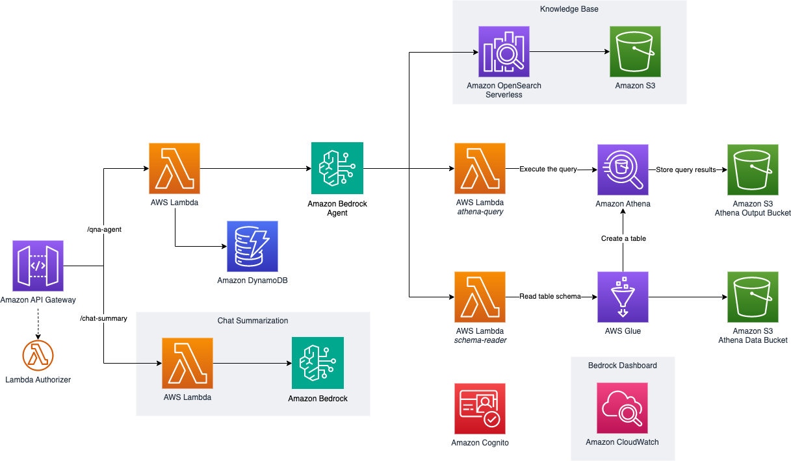

import { Card, CardGrid } from '@astrojs/starlight/components';
import { Tabs, TabItem } from '@astrojs/starlight/components';
import { Steps } from '@astrojs/starlight/components';

## 사용 가능한 배포 옵션

요구사항에 가장 적합한 배포 시나리오를 선택하세요. 각 옵션은 고유한 기능과 AWS 서비스 통합을 제공합니다.

<CardGrid stagger>
  <Card title="챗봇" icon="seti:default">
    지식 베이스와 액션 그룹 통합이 포함된 Amazon Bedrock Agent 기반 AI 챗봇
    
    **주요 기능**
    - Amazon Bedrock Agent 기반 표준 챗봇
    - AWS Lambda 기반 샘플 액션 그룹 (비밀번호 변경, 에스컬레이션)
    - 메타데이터 필터링이 가능한 Amazon OpenSearch Serverless 기반 지식 베이스
    - Amazon Cognito 인증 UI
    - 채팅 요약 기능
    
    [챗봇에 대해 자세히 알아보기](/ko/intro/use-case-selection#챗봇)
  </Card>

  <Card title="Text2SQL" icon="seti:odata">
    Amazon Bedrock Agent를 사용한 자연어에서 SQL로의 변환
    
    **주요 기능**
    - 기본 프롬프트를 사용한 텍스트에서 SQL로의 변환
    - 데모 데이터가 포함된 샘플 Amazon Athena 테이블
    - AWS Lambda 기반 액션 그룹을 통한 SQL 쿼리 실행
    - 동적 스키마 추출
    - 지식 베이스 통합 (선택사항)
    
    [Text2SQL에 대해 자세히 알아보기](/ko/intro/use-case-selection#text2sql)
  </Card>

  <Card title="완전한 솔루션" icon="rocket">
    챗봇과 Text2SQL 기능 모두 배포
    
    **주요 기능**
    - 두 사용 사례의 모든 기능
    - 포괄적인 데모 환경
    - 풀스택 배포
    - 완전한 모니터링 설정
    
    [완전한 솔루션에 대해 자세히 알아보기](/ko/intro/use-case-selection#완전한-솔루션)
  </Card>
</CardGrid>

## 서비스 통합 개요

<Tabs>
  <TabItem label="챗봇 서비스">
    - [Amazon Bedrock](https://aws.amazon.com/bedrock/)
    - [Amazon OpenSearch Serverless](https://aws.amazon.com/opensearch-service/)
    - [Amazon S3](https://aws.amazon.com/s3/)
    - [Amazon API Gateway](https://aws.amazon.com/api-gateway/)
    - [AWS Lambda](https://aws.amazon.com/lambda/)
    - [Amazon DynamoDB](https://aws.amazon.com/dynamodb/)
    - [Amazon CloudWatch](https://aws.amazon.com/cloudwatch/)
    - [Amazon IAM](https://aws.amazon.com/iam/)
    - [Amazon Cognito](https://aws.amazon.com/cognito/)
  </TabItem>
  
  <TabItem label="Text2SQL 서비스">
    - [Amazon Bedrock](https://aws.amazon.com/bedrock/)
    - [Amazon S3](https://aws.amazon.com/s3/)
    - [AWS Glue](https://aws.amazon.com/glue/)
    - [Amazon Athena](https://aws.amazon.com/athena/)
    - [Amazon API Gateway](https://aws.amazon.com/api-gateway/)
    - [AWS Lambda](https://aws.amazon.com/lambda/)
    - [Amazon DynamoDB](https://aws.amazon.com/dynamodb/)
    - [Amazon CloudWatch](https://aws.amazon.com/cloudwatch/)
    - [Amazon IAM](https://aws.amazon.com/iam/)
    - [Amazon Cognito](https://aws.amazon.com/cognito/)
  </TabItem>
</Tabs>

:::tip[권장사항]
프로젝트가 처음이시라면, 챗봇이나 Text2SQL 사용 사례 중 하나를 개별적으로 시작하는 것을 권장합니다. 이는 완전한 솔루션을 배포하기 전에 구성 요소를 더 잘 이해하는 데 도움이 될 것입니다.
:::

## 사용 가능한 사용 사례

### 챗봇
지식 베이스와 액션 그룹 통합이 포함된 AI 기반 챗봇

#### 기능
- 표준 챗봇 프롬프트가 포함된 Amazon Bedrock Agent
- 에이전트용 샘플 액션 그룹: 비밀번호 변경, 에스컬레이션
- 샘플 데이터가 포함된 지식 베이스 및 메타데이터 필터링
- Cognito 인증이 포함된 로컬 호스트에서 실행되는 샘플 UI
- 자체 UI와 통합할 수 있는 REST API
   - QnA 에이전트 API: 에이전트를 호출하고 DynamoDB 테이블에 세션 정보를 저장하는 Lambda 백엔드
   - 채팅 요약 API (선택사항): 향후 사용을 위해 Amazon Lite 모델을 호출하여 채팅 기록 요약
   - 예시로 제공되는 Lambda 커스텀 인증자

### Text2SQL
Bedrock Agent를 사용한 자연어에서 SQL로의 변환

#### 기능
- 기본 Text2SQL 프롬프트가 포함된 Amazon Bedrock Agent
   - 에이전트 지침
   - 오케스트레이션 템플릿
- 샘플 데이터가 포함된 샘플 Athena 테이블 `products` 및 `reviews`
- Athena에 대한 SQL 쿼리 실행을 위한 Bedrock 액션 그룹 (`athena-query`)
- Athena에서 동적으로 스키마 정보를 추출하는 Bedrock 액션 그룹 (`schema-reader`)
- (선택사항) 샘플 데이터가 포함된 지식 베이스 및 메타데이터 필터링
- Cognito 인증이 포함된 로컬 호스트에서 실행되는 샘플 UI
- REST API 통합 기능

### 완전한 솔루션
:::note
이 옵션은 챗봇과 Text2SQL 사용 사례를 모두 배포하며, 위에서 언급한 모든 리소스를 생성합니다.
:::

## 다음 단계

사용 사례를 선택한 후:
<Steps>
1. [배포 가이드](/ko/intro/deployment)에 따라 단계별 지침을 따르세요.

2. [사용자 정의 가이드](/ko/guides/customization-guide)를 사용하여 솔루션을 맞춤화하세요.

3. [샘플 API 테스트 가이드](/ko/guides/api-testing-guide)로 배포를 테스트하세요.

4. 완료 후 [정리 가이드](/ko/guides/cleanup-guide)를 따라 정리하세요.
</Steps>

:::note
모든 배포에는 다음과 같은 기본 인프라가 포함됩니다:
- Cognito 인증
- REST API 엔드포인트
- DynamoDB 세션 저장소
- CloudWatch 모니터링
::: 